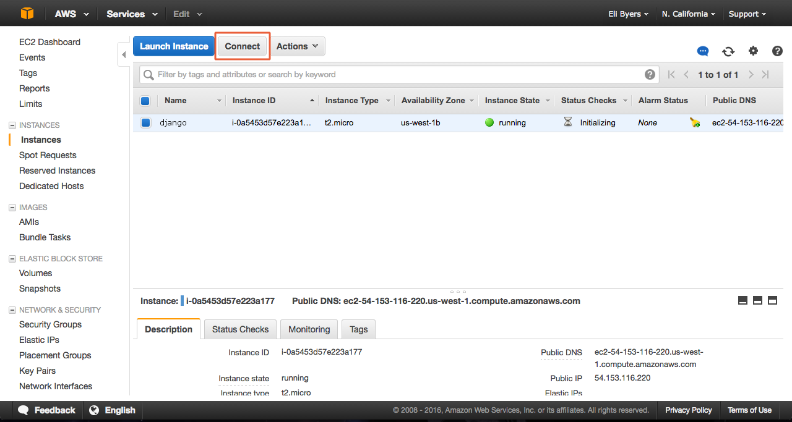

#Django Deployment

----
Today you will be deploying your Courses app from the Django models chapter.

When you take your belt exam you will simply replace the courses project with your belt exam project.

We're going to use github to create a copy of our project in deployment.

In the first 2 steps, we will be navigating around on your local machine.  If you are using unix(mac), or linux, these commands are for you.  If you are on Windows, you will want to use git bash in order for these commands to run properly.

## Step 1: Getting Started

Get started by activating your virtual environment.

Once you have activated your virtual environment, cd into your project directory.  You will now save all of your installed pip modules in a .txt, so that when you deploy your project, all modules will be automatically installed:

```bash
pip freeze > requirements.txt
```

**In your text editor, open your requirements.txt file and remove pygraphviz, pydot and mysql if present. these modules can be tricky to install and require additional installations, so we remove them now to prevent problems later.**

## Step 2: Committing

**Important!**

We're about to initialize a new git repo. Your git repo must be initialized within the outer project folder, this is the same level as your `manage.py` file. If you `ls` and don't see `manage.py`, you are in the wrong place. Double check your location before you initialize your repo.

First we'll create a `.gitignore` file.

```bash
touch .gitignore
```

As the name implies, your gitignore file tells git to ignore any files, directories, etc. you include in the file.  In this case, we're instructing git to ignore all files with the extension "pyc", as well as your virtual environment, if you have placed one inside of your project folder, in your gitingnore file, `venv/` should be replaced with the name of your virtual environment.

Open your `.gitignore` file in your text editor and add the lines:

 ```
 *.pyc
 venv/
 ```

We know this is familiar, but here's a reminder of how to initialize a new repo:

```bash
> git init
> git add --all
> git commit -m "initial commit"
```
Create a new github repo and, back in terminal run these commands, replacing the repo url with your own.

```bash
> git remote add origin https://github.com/AnnaBNana/courses.git
> git push origin master
```

Once you login to AWS and set up a cloud server, you'll be pulling code from your GitHub repository.

## Step 3: Creating an EC2 server instance

>Note: You'll need an AWS account, which you can sign up for [here](http://aws.amazon.com). It's free for a year, so long as you don't have more than 1 (free-tier) instance up at a time!

1. Login to AWS Console at [https://aws.amazon.com/](https://aws.amazon.com/)
2. Once you have logged in you will see your dashboard page:

3. Launch a new instance from the EC2 Dashboard, as shown below:

4. Select *Ubuntu Server 16.04* option.  Be sure to scroll close to the bottom to find the correct version of Ubuntu. The opton closest to the top will get you a newer version, which doesn't play well with pip and virtualenv.
<!-- replace this image - timchen -->

5. Select *t2.micro* option and click *Review and Launch*


### Security settings

1. Click the *Edit security groups* link in the ower right corner

2. SSH option should be there already. Reset SSH source from the dropdown menu to MyIP (this has to be updated everytime you change IP addresses.)

3. Click the add a rule button twice to add HTTP and HTTPS, source set to *Anywhere*, and then click ***Click Review and Launch:***

4. Click the add a rule button and create a custom TCP rule, the port to 8000 and the source to My IP.
5. You'll be asked to create a key file. This is what will let us connect and control the server from our local machine.

	Name your pem key whatever makes the most sense to you as shown in the next step.  Give it a generic name, not the name of your project, as we will be re-using this instance.

	The key will automatically be saved to your downloads folder when you click launch instance, but you will want to move it.  See the next item for more information on this critical step.


6. This next part is very important! Put your pem key in a file that has no chance of ***EVER***  being pushed to github. You should not send this file via email, or in any other way make it publicly available:

7. After launching your instance, you will see a rather confusing screen with some information, as shown below.  In order to move on, scroll to the bottom of the page and confirm that you would like to view your instance.

8. Once you have several instances running, you will want to be able to identify what your different instances are for.  We have the option of naming our instance, so let's do so now by clicking on our instance's name column as shown.


##Step 4: Connecting to your remote server

Back in your terminal, cd to the folder that holds the key file you just downloaded.
=======

```bash
> cd /projects/AWS
```

Now we're ready to use our .pem file to connect to the AWS instance! In your AWS console, click connect and use the supplied code in your terminal (PC users: use a bash terminal to do this).

Back in your AWS console click the connect button at the top of your screen here:



A popup will appear with instructions on how to connect.  If you are a mac user, run the chmod command, otherwise, skip this command and copy and paste the line starting with ssh into your terminal.

=======

You might have to type yes and wait for a few seconds to a minute before you are connected, but if all goes well, you should be in your Ubuntu cloud server. Your terminal should show something like this in the far left of your prompt:

```bash
ubuntu@20.669.38.527:~$ #Commands you write appear here
```

## Step 5: EC2 Server Application Configuration

Now we are going to set up our remote server for deployment. Our server is nothing more than a small allocated space on some else's larger computer (in this case, the big computer belongs to Amazon!).  That space has an installed operating system, just like your computer.  In this case we are using a distribution of linux called Ubuntu, version 16.04.

Although we have linux, our new computer is otherwise empty.  Let's change that so we can start building a server capable of providing content that the rest of the world can access. In order to do so, we have to install some key programs first.  First let's install python, python dev, pip, nginx, and git

In the terminal:

```bash
ubuntu@20.669.38.527:~$ sudo apt-get update
ubuntu@20.669.38.527:~$ sudo apt-get install python-pip python-dev libpq-dev gresql postgresql-contrib nginx
```
Now that we've installed some packages using apt-get, let's run update again to make sure apt-get knows we've done those installations.  

In addition, you'll use your newly installed pip to install the virtual environment program so that you can now build a brand new virtual environment on your new computer.

```bash
ubuntu@20.669.38.527:~$ sudo apt-get update
```

## Step 6: Configuring your PostgreSQL database

Next up let's get our database up and running. Postgres uses a authentication scheme called "peer authentication". This means that if the users operating system matches a valid Postgres username the user can login with no further authentication.

During the Postgres installation, an operation system user was created and named postgres which corresponds to the postgres PostgreSQL admin user. This user will be used to perform admin tasks.

We login by passing in the username like this:

```bash
ubuntu@20.669.38.527:~$ sudo -u postgres psql
```

You should now see something like this:

```bash
postgres=*
```

This is our PostgreSQL prompt, here we can set up the requirements needed for our Django Project. In the next few steps we're going to:

 - Enter the PostgreSQL console
 - Create and name a database
 - Create a user and password for the database
 - Optimize our database for the Django framework
 - Grant necessary privileges to our newly created user

 (NOTE: The semicolons you're going to see in the code blocks below cannot be omitted, it signifies the end of a psql command. The psql prompt is also case sensitive.)

Type in:
```bash
postgres=* CREATE DATABASE courses;
```

Next up, let's create a database user and set a password.

Type in:
```bash
postgres=* CREATE USER ubuntu WITH PASSWORD 'password';
```

Now, let's modify a few of the connection parameters, this speeds up our database operations.

Type in:
```bash
postgres=* ALTER ROLE ubuntu SET client_encoding TO 'utf8';
```

Type in:
```bash
postgres=* ALTER ROLE ubuntu SET default_transaction_isolation TO 'read committed';
```

Type in:
```bash
postgres=* ALTER ROLE ubuntu SET timezone TO 'UTC';
```

These are all default settings recommend by the Django Project if you'd like to learn more about this database optimization process.
https://docs.djangoproject.com/en/1.9/ref/databases/#optimizing-postgresql-s-configuration

Now let's give out user access to administrate on the database.

Type in:
```bash
postgres=* GRANT ALL PRIVILEGES ON DATABASE courses TO ubuntu;
```

Let's leave the psql prompt and move on. To do this..

Type in:

```bash
postgres=* \q
```
In review, we've

<!-- END DATABASE CONFIGURATION -->

## Step 7: Configuring your virtual environment
<!-- START VIRTUAL ENVIRONMENT CONFIGURATION -->

Remember our virtual environments? Our Django project will need one on our Ubuntu machine as well. Note that now that we have SSH in a linux machine, we can all use \*nix commands.

First up, we have to get virutalenv onto our ubuntu machine.

ubuntu@20.669.38.527:~$ sudo pip install virtualenv

Now that we have virtualenv installed, let's start putting together the project!

ubuntu@20.669.38.527:~$ mkdir djangoProject
ubuntu@20.669.38.527:~$ cd djangoProject
ubuntu@20.669.38.527:~$ virtualenv djangoEnv

These commands, created a djangoProject folder, navigated into the project folder, and created a virtual environment. Before we can make changes to our virtual environment we have to activate it. Do so by typing this in:

ubuntu@20.669.38.527:~$ source djangoEnv/bin/activate

You should now see a (djangoEnv) in front of your normal terminal prompt, this let's us know that our virtual environment is active.

Now we have to install Django, Gunicorn, and psycopg which is our PostgreSQL adaptor. If you'd like to learn more about each of these components check out their documentation!

To install these components send this command into your terminal:

(djangoEnv) ubuntu@20.669.38.527:~$ pip install django gunicorn psycopg2

<!-- END VIRTUAL ENVIRONMENT CONFIGURATION -->

<!-- BEGIN PORTING LOCAL DEV DJANGO APP TO PRODUCTION DJANGO APP -->

Now that we have some of our deployment infrastructure complete, let's begin working on configuring our Django project.

First up, let's git clone our project.

ubuntu@20.669.38.527:~$ git clone https://github.com/YOURUSERNAME/YOURREPONAME.git

At the moment your current folder directory should looks something like this.

```bash
- ubuntu
  - repoName
    - apps
    - projectName
    - ... # other files/folders
```

Navigate into this project and run `ls` in your terminal. If you don't see `manage.py` as one of the files, *STOP*. Review the setting up GitHub/Git pieces from earlier.

From within the project level folder, let's make some modifications to the settings.py file.

We can make these modifications by typing in the following:

ubuntu@20.669.38.527:~$/djangoProject/courses_deployment/Courses$ sudo nano settings.py

Set DEBUG to False, next...

Locate this
  ALLOWED_HOSTS = []

Now type in the Public IP associated with you server instace, this can be found in the description tab in the AWS instance dashboard.

ALLOWED_HOSTS = ['12.123.123.123']

Next, were going to configure our database settings.

Locate this:
  DATABASES = { ... }

The current configuration is set to SQLite, and now that we're putting our application into production, we're going to have to change some settings to work with the PostgreSQL database we created earlier.

Change the settings so they mirror this:

DATABASES = {
    'default': {
        'ENGINE': 'django.db.backends.postgresql_psycopg2',
        'NAME': 'courses',
        'USER': 'ubuntu',
        'PASSWORD': 'password',
        'HOST': 'localhost',
        'PORT': '',
    }
}

Further down you'll come across a line that describes where static files can be found. We'll need to add a line here so that Nginix will have the ability to handle requests to serve requested static files.

The last two lines in your settings.py file should have these two lines:

STATIC_URL = '/static/'
STATIC_ROOT = os.path.join(BASE_DIR, 'static/')

Save and close by pressing CTRL+X, choosing Yes, and writing to the setting.py file.

Let's see if what we've down works by migrating our project.

Navigate into the project, and run the following commands.

ubuntu@20.669.38.527:~$/djangoProject/courses_deployment/Courses$ cd ..
ubuntu@20.669.38.527:~$/djangoProject/courses_deployment$ ./manage.py makemigrations
ubuntu@20.669.38.527:~$/djangoProject/courses_deployment$ ./manage.py migrate

If you encounter any errors, first, read the error that is reported and make necessary changes, if the errors still persist get a fresh pair of eyes to take a look at your recent changes. DO NOT attempt to write your own settings or configurations.

After a sucessful migration, lets create an administrative user for the project.

ubuntu@20.669.38.527:~$/djangoProject/courses_deployment$  ./manage.py createsuperuser

The next few prompts will ask your to choose a username, password, and email.

Use 'ubuntu' as your username
Use your email address
Enter a password, I used django***

Collect your static files with this command.

ubuntu@20.669.38.527:~$ /djangoProject/courses_deployment$ ./manage.py collectstatic

Let's test our deployed Django development sever out..

Type in:
ubuntu@20.669.38.527:~$ /djangoProject/courses_deployment$ ./manage.py runserver 0.0.0.0:8000

If you see your app, then everything is working and you now have a development server running. This is excellent progress, if you have your admin routing intact in your Django project, you can add /admin to the end of the URL and access your admin panel, use the username and password you typed in when the createsuperuser command was run.

<!-- Testing Gunicorns Ability to Serve the Project -->

Before we leave the virtual environment, let's test and make sure Gunicorn works the way we want it too. We'll do this by navigating to your project and then binding Gunicorn to it.

When you run these commands, you want to be in the folder that contains the manage.py file

This line Courses.wsgi:application, Courses should be the name of your project folder that contains a wsgi.py file.

Type in these commands:
ubuntu@20.669.38.527:~$ djangoProject/courses_deployment$ gunicorn --bind 0.0.0.0:8000 Courses.wsgi:application

We are testing Gunicorn by passing it a relative path to our Django's project wsgi.py file which is the entry point to our application.

After the worker stars, stop the test by pressing CTRL+C and stop the workers.

We are now done with our virtual environment, we can exit it by typing

ubuntu@20.669.38.527:~$ deactivate

<!-- Gunicorn systemd Service File -->
As Linux distributions continue to evolve and change, more of them are adopting the systemd init system. This software manages controls aspects of your server including services which is what Gunicorn is going to be.

To create a systemd service file that will turn Gunicorn on and off we're going to open a systemd service file and make some changes.

Type in:
ubuntu@20.669.38.527:~$ sudo nano /etc/systemd/system/gunicorn.service

~home
  - ubuntu
    - djangoProject
      - myprojectenv
      - courses_deployment
        - Courses
        - apps

Once the nano text editor opens up type in the following:

[Unit]
Description=gunicorn daemon
After=network.target

[Service]
User=ubuntu
Group=www-data
WorkingDirectory=/home/ubuntu/courses_deployment
ExecStart=/home/ubuntu/djangoProject/djangoEnv/bin/gunicorn --workers 3 --bind unix:/home/ubuntu/courses_deployment/Courses.sock Courses.wsgi:application

[Install]
WantedBy=multi-user.target

Now that our service file has been created, we can enable it so that it starts on boot with these commands.

ubuntu@20.669.38.527:~$
sudo systemctl daemon-reload
systemctl start gunicorn
systemctl enable gunicorn
ubuntu@20.669.38.527:~$ sudo systemctl enable gunicorn

<!-- END GUNICORN SERVICE CONFIGURATION -->

<!-- BEGIN NGINX CONFIGURATION -->

We're going to configure Nginx so that it will pass pass traffic to Gunicorn. We will start by creating a sites-available directory.

Do this by typing in:

ubuntu@20.669.38.527:~$ sudo nano /etc/nginx/sites-available/djangoProject

In this file add the following:

server {
    listen 80;
    server_name 54.146.185.204;

    location = /favicon.ico { access_log off; log_not_found off; }
    location /static/ {
        root /home/ubuntu/courses_deployment;
    }

    location / {
        include proxy_params;
        proxy_pass http://unix:/home/ubuntu/courses_deployment/Courses.sock;
    }
}


Save and close out of nano. We can enable this file by linking it to the sites-enabled directory:

ubuntu@20.669.38.527:~$ sudo ln -s /etc/nginx/sites-available/courses_deployment /etc/nginx/sites-enabled

Test your Nginx configuration for syntax errors by typing:

ubuntu@20.669.38.527:~$ sudo nginx -t

Fix any errors is needed, once clear, type in:

sudo systemctl restart nginx

if a firewall was made...

sudo ufw allow 'Nginx Full'

<!-- BEGIN OLD CONTENT  -->

Now visit your site! You should be finished at this point, with a fully functioning site.  Your old data will not show up, but you should be able to perform all operations as you did previously.

## Step 10.01: Reconnecting

Remember how we said that we would have to change our security settings every time our IP changes?  The bad news is that this will be every time we try to reconnect.  The good news is that it's easy to change those settings, if you know where to look.

1.  In your aws console, with your instance selected, scroll down to view some options.  Next to security groups, you will see launch-wizard.  Click it!

2. Now you just have to update the IP connected to the instance.  In the next window you will see something like this at the bottom of your screen. Click the inbound tab, and then select edit.

3. Now, all that is left to do is let AWS automatically change our IP to the new one. Do this by selecting the dropdown in the SSH row, under source, and select MyIP (it is already selected, but doing so again will refresh your IP to the current one). Once this is done, click save.  Your're ready to SSH into your instance again!

